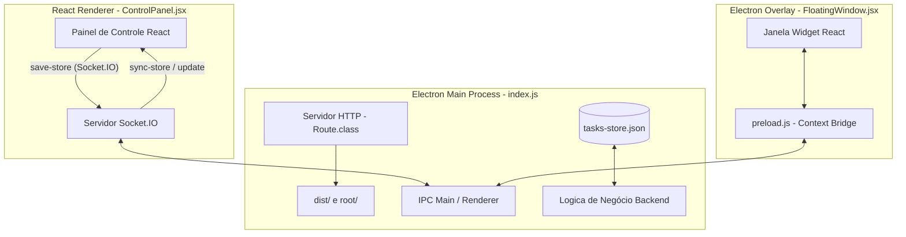

# 🌐 WorkTimeBar


> Um assistente de foco minimalista e de alta fidelidade desenvolvido com **Electron**, **React**, **Vite** e **Tailwind CSS**. 
> O **WorkTimeBar** oferece um widget flutuante e transparente (overlay) que fica sempre visível no topo da tela, permitindo acompanhar em tempo real o progresso das suas atividades diárias e gerenciar seu tempo de forma fluida.

---

## 🎨 Principais Recursos & Implementações Recentes

### 1. Visual Baseado no ForgeUI
*   **Design Escuro Ultra Premium**: A interface do painel e do overlay utiliza paletas de cores escuras profundas, efeitos de desfoque de fundo (*glassmorphic backdrop blur*), bordas refinadas e gradientes de cores vibrantes (neon).
*   **Luz de Fundo Ambiente Dinâmica**: O widget possui uma barra de brilho neon no topo com efeito de pulso suave e flutuação lenta no eixo X (`soft-bounce`), proporcionando um visual tecnológico premium sem atrapalhar a arrastabilidade e o uso da janela.
*   **Cards Interativos**: Seleção e ativação de tarefas diretamente clicando em qualquer lugar do card da atividade, com indicadores circulares de seleção dedicados.


### 2. Sistema de Modais e Confirmações Customizados
*   **Substituição de Diálogos Nativos**: Removemos todos os alertas e confirmações nativas do navegador (`alert()` / `confirm()`), substituindo-os por modais customizados ForgeUI com transições suaves (`fadeIn` / `scaleIn`), ícones contextuais e variações de acento neon:
    *   🔴 **Perigo (Danger)**: Utilizado para a remoção total de atividades da lista.
    *   🟡 **Aviso/Erro (Error)**: Para falhas em importações ou arquivos JSON corrompidos.
    *   🟢 **Sucesso (Success)**: Confirmações de importação completadas com sucesso.
 


### 3. Banco de Dados Local Resiliente (Main Process)
*   **Fonte Única da Verdade**: Criamos um armazenamento persistente em arquivo (`tasks-store.json`) gerenciado pelo processo principal do Electron.
*   **Sincronização Bidirecional**: As informações de progresso e meta de horas diárias são mantidas atualizadas, permitindo que a troca de tarefas pelo widget funcione mesmo se a aba do navegador estiver fechada.
*   **Prevenção de Sobrescrita de Dados**: Mecanismo de segurança com controle de sincronia (`hasSynced`) para evitar que conexões parciais ou recargas de página limpem os dados do banco de dados local.
*   **Escrita Atômica e Debounce**: O sistema escreve em um arquivo temporário antes de substituir o banco de dados oficial (evitando corrupções se o app for desligado de surpresa) e limita as escritas periódicas automáticas a uma frequência máxima de 15 segundos (debounce).

### 4. Gestão Avançada de Tempo
*   **Cálculo Altamente Preciso**: Migração para cálculos baseados no relógio do sistema (`Date.now() - startTime`), eliminando o desvio de tempo acumulado (drift) comum em loops tradicionais de `setInterval`.
*   **Acúmulo de Pausas Resiliente**: O tempo gasto em pausa é acumulado cumulativamente ao longo de múltiplos ciclos de play/pause sem perder o histórico do tempo inativo anterior.
*   **Alocação Flexível de Tempo**: Renomeado o antigo "Tempo Livre" para **Alocar Tempo Fixo** com lógica invertida. As tarefas flexíveis compartilham dinamicamente o tempo que resta da meta diária, atualizando suas durações em tempo real.

### 5. Edição Inline e Integração do Logotipo
*   **Edição Direta**: Botão de edição rápida (lápis) que transforma o título do card em um campo de texto (`input`). Suporta salvar com **Enter**, cancelar com **Esc** e auto-salvamento ao desfocar o campo (`onBlur`), atualizando o widget instantaneamente.
*   **Favicon Integrado**: A logo nativa do projeto (`favicon.ico`) foi adotada na barra superior do painel e no estado inativo do widget como um avatar circular elegante.

---

## 📐 Arquitetura e Comunicação Técnica



### Protocolo de Mensagens (IPC & Sockets)

#### IPC (Entre Widget e Main Process)
*   `online` (Enviado pelo Widget ao iniciar): Registra o canal de comunicação para que o processo principal saiba para onde enviar as atualizações.
*   `status` (Enviado a cada segundo pelo Widget): Transmite o progresso atualizado de tempo rodando e de pausas.
*   `finish` (Enviado pelo Widget): Notifica a conclusão de uma atividade, disparando uma notificação nativa do sistema operacional (`Notification`).
*   `next` / `back` (Enviado pelo Widget): Solicita a alteração da tarefa ativa para a próxima/anterior na fila.
*   `exit` (Enviado pelo Widget): Encerra graciosamente todos os processos e zera as atividades ativas antes de fechar.

#### Sockets (Entre Painel Web e Main Process)
*   `sync-store` (Enviado pelo Servidor): Atualiza o painel com as atividades e horas do banco.
*   `save-store` (Enviado pelo Painel): Atualiza o banco do Electron com novos cadastros, edições ou exclusões de tarefas.
*   `evento` (Enviado pelo Painel): Ativa uma tarefa no widget.
*   `stop` (Enviado pelo Painel): Pausa ou para todas as atividades.
*   `update` (Enviado pelo Servidor): Envia progresso em tempo real das atividades para exibição no painel.

---

## 🛠️ Como Instalar e Rodar

### Pré-requisitos
*   **Node.js** (v16 ou superior)
*   **npm** ou **yarn**

### Instalação de Dependências
```bash
# Instale os pacotes necessários
npm install
```

### Compilar a Aplicação (Build)
Sempre que fizer alterações no código HTML, CSS ou React/JSX, execute a compilação para atualizar os arquivos estáticos de produção:
```bash
npm run build
```
*(Nota: No Windows, caso haja restrições de execução de scripts no PowerShell, execute utilizando `cmd /c npm run build`)*

### Executar a Aplicação (Electron + Web Server)
Inicie a aplicação compilada:
```bash
npm start
```
Após o início, a janela do Electron (Overlay) aparecerá na tela. Para acessar o painel de gerenciamento, abra seu navegador no endereço:
👉 **[http://localhost:8585](http://localhost:8585)**

### Compilação de Produção (Packaging)
Para gerar o executável standalone compactado para Windows:
```bash
npm run package-win
```

---

## 🔒 Segurança de Caminhos (Path Traversal Guard)
O servidor de arquivos embutido (`Route.class.js`) resolve os caminhos utilizando segurança a nível de diretório. As rotas para servir os assets compilados do Vite (`/dist/`) e os arquivos do projeto (`/src/`) são validadas de forma que todas as requisições resolvidas com `path.resolve()` obrigatoriamente iniciem com o caminho absoluto da pasta raiz do projeto. Qualquer tentativa de requisição usando padrões de fuga de diretório (como `../../`) fora do escopo do projeto receberá um retorno `404 Not Found`.
